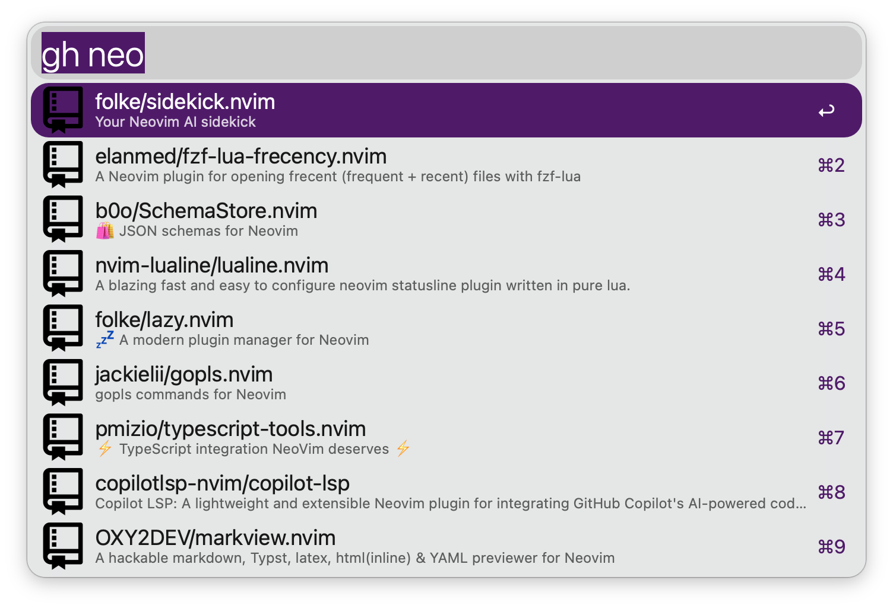
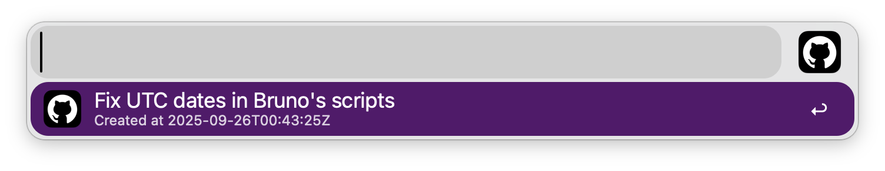

# GitHub alfred workflow

This workflow allows you to search for your GitHub repositories (created, starred, watched and org repos are considered).

You can:

- Browser {created,starred,org,watched} repos

  

  - Copy git repository URL to your clipboard (useful for cloning)

  - Open the repository/issues/PRs pages in your browser

  - List your open PRs in the repository, and navigate to them

      

- Browser your open PRs across all repositories

## Requirements

- `Go` (to build the workflow binary)

This workflow rely on `Go` to build its own binary. For safety reasons, the binary is not shipped with the workflow. The workflow will build it itself on its first run. This flow allows you to review the code yourself by opening the workflow folder.

- `GitHub Personal Access Token`

Head over to your [GitHub settings](https://github.com/settings/tokens) and create a new token with the `repo` and `admin:org` scopes.
